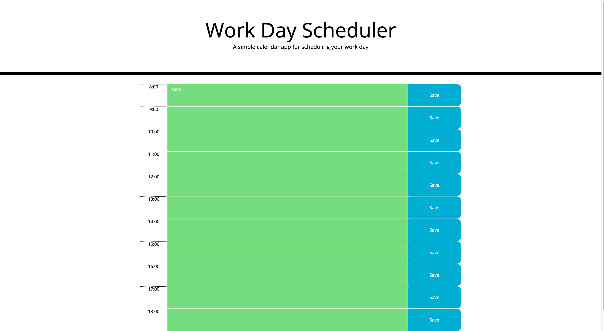

# Work-Day-Scheduler
homework-5

🦾 ABOUT THIS PROJECT

This is a work-day planner. The purpose of this project is to help you organize your day better and be more productive

🖥 HOW TO USE

Very easy to use. All you need to do is input in your todo for the day and click save. 

Don't worry about closing the page or if you accidentally refresh the page. Your todos will be saved for you to come back to.

🐱 GitHub Links

Repository: https://github.com/vynguyen205/Work-Day-Scheduler

Deployed: 

🔍 Notes + Articles

This project was hard because I am currently still not quite comfortable with using javascript. I still have to do a lot of research in order t figure out how to populate the time, and the make sure the buttons are working.